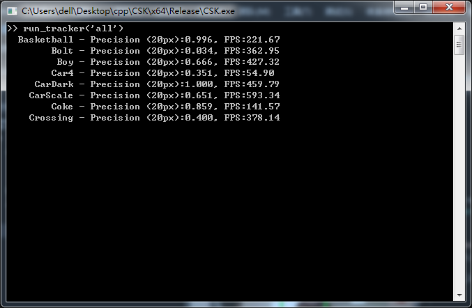
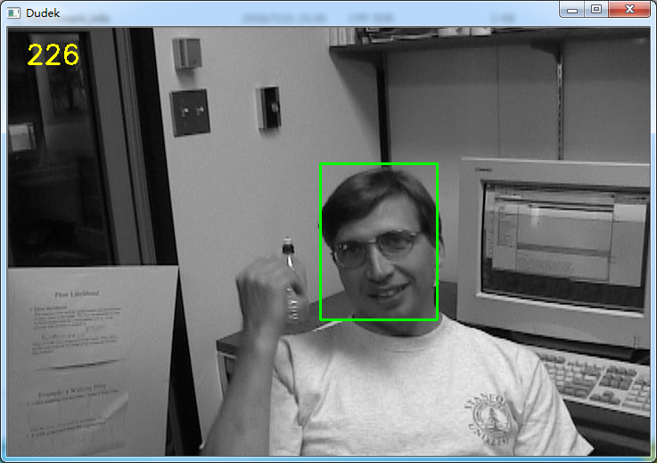

# CSK
I just want to build a c++ preject for CSK.

##It looks like MATLAB.

##Simple gui(I will change it to the KCF version 2 via Trackbar)
It's quite difficult to draw gui like MATLAB,but the Trackbar function is quite useful!(if you tried KCF MATLAB code)

Reference
----------
* [Exploiting the Circulant Structure of Tracking-by-detection with Kernels](http://www.robots.ox.ac.uk/~joao/circulant/)
